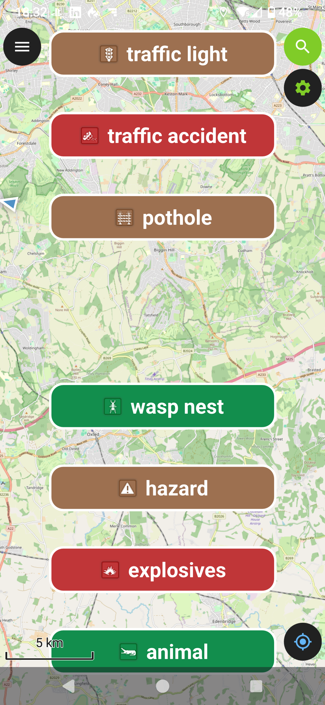

# Quick Capture QField Plugin

Intended for Big Button feature capture.

## Installation
To install the plugin, download the plugin from the [releases](https://github.com/coastalrocket/quick_capture/releases) page and follow the [plugin installation guide](https://docs.qfield.org/how-to/plugins/) to install the zipped plugin in QField.

## How to configure
Long press on the Settings icon to display the setting dialog.
Short tap on the Settings icon to turn feature capture buttons on/off. 

To capture features you need a single point layer with a text attribute.
If the point layer contains:
- an attachment field called 'photo' this will be populated if photos are enabled
- a date/time field called timestamp will be populated

### How to define capture types
From the settings dialog you can edit the comma-delimited list of types that define the buttons.

To colour buttons and display an icon in the button you'll need to create a non-spatial table in the project called 'quick_capture_types'. The table should contain the following fields:
- 'type' text field: controls the type
- 'icon' text field: relative path in the project to the icon
- 'text_hex' text field: controls the text colour with a hex value e.g. '#FFFFFF'
- 'background_hex' text field: controls the background colour with a hex value.

You can find an example set up in [this](https://app.qfield.cloud/a/andybmapman/quick_capture/) project.

